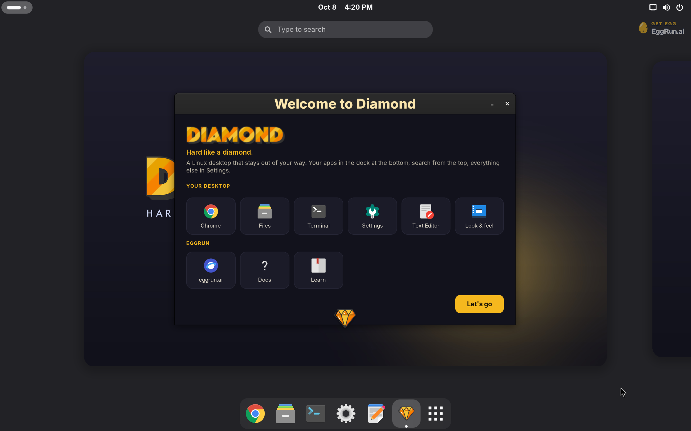
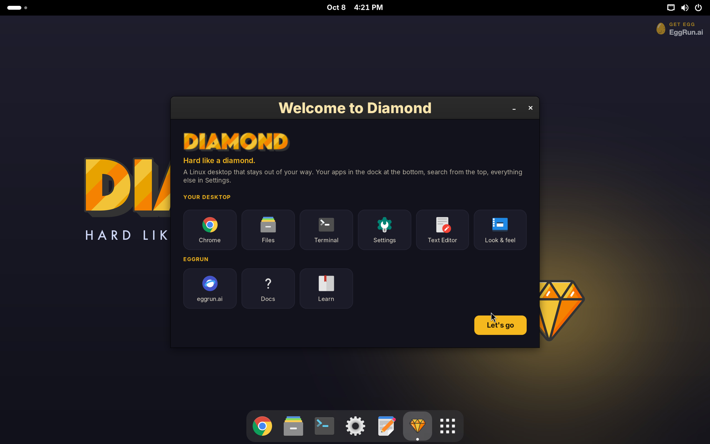
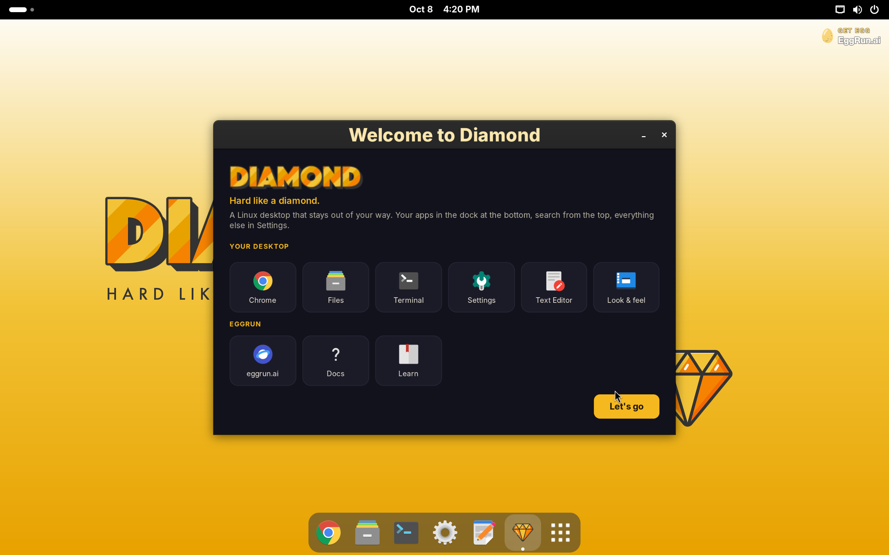
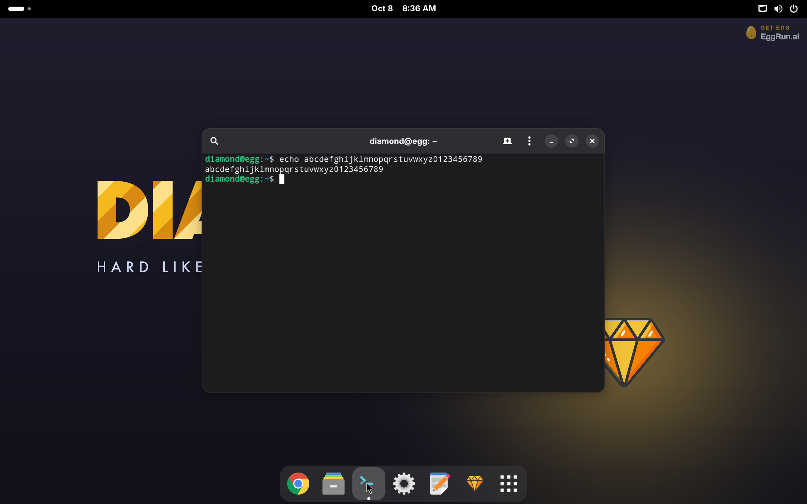

# Diamond Linux

**Hard like a diamond.** A beautiful, easy Linux desktop for people who found Linux hard
to learn. Debian 13 underneath, GNOME 48 on top, Google Chrome, and Claude and Codex ready on
the dock. Everything built for Linux runs.

Diamond is delivered as an **egg**: a complete computer as a file that installs like an app
and starts from a warm snapshot. Get it from the EggRun hub as `egg/diamond`, or build it
yourself from this repository.

Sites: [diamondlinux.org](https://diamondlinux.org) · [eggrun.ai](https://eggrun.ai)

## Screenshots






## What is inside

- Debian 13 (trixie), apt, glibc
- GNOME 48 on Wayland: Files, Console, Settings, Text Editor, Document Viewer, Image Viewer,
  Calculator, Archive Manager; Dash to Dock for the floating dock
- Google Chrome (Google's arm64 build)
- Claude Desktop and Claude Code from Anthropic's apt repositories
- ChatGPT with Codex (OpenAI's Linux preview) and the Codex CLI
- Dark style by default, light style one click away, a Diamond wallpaper for each
- A Welcome window on first login that says where things are
- One local account, `diamond` / `diamond`, with sudo. Nothing else is baked in; every app
  signs in with your own account on first launch

## Build it

With [EggRun](https://eggrun.ai) installed:

```
egg build --egg diamond .
egg run diamond
```

The `Eggfile` is the whole recipe. It starts from the `egg/debian-13` base, installs the
packages, copies the files in this repository into place, and finishes by trimming the disk so
the published egg ships only live blocks.

## Layout

| Path | What |
|---|---|
| `Eggfile` | the recipe |
| `diamond.gschema.override` | GNOME defaults: dock, dark style, wallpapers, favourites |
| `gdm/daemon.conf` | autologin |
| `welcome/` | the Welcome window (Python + GTK) and its launchers |
| `ai/` | launchers and icons for Claude CLI and Codex CLI, the EggRun mark |
| `wallpaper-dark.jpg`, `wallpaper-light.jpg` | the two wallpapers, 2560x1600 |
| `logo.png`, `menu-diamond.png`, `diamond.svg` | the gem |
| `wordmark.png`, `wordmark-tight.png` | the DIAMOND wordmark |
| `screenshots/` | what ships on the hub card |

## Credits

Diamond stands on other people's work. See [CREDITS.md](CREDITS.md).

## Licence

The recipe, the Welcome app, the configuration and the Diamond artwork are © Camouflage
Networks Inc. and released under the licence in [LICENSE](LICENSE). Third-party names and
marks referenced here belong to their owners; see CREDITS.md for the carve-outs.
